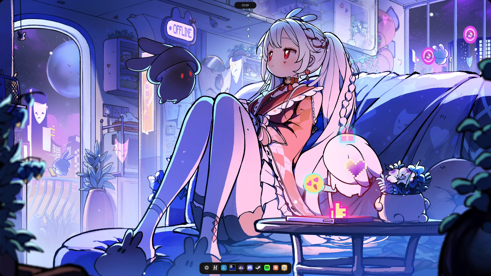
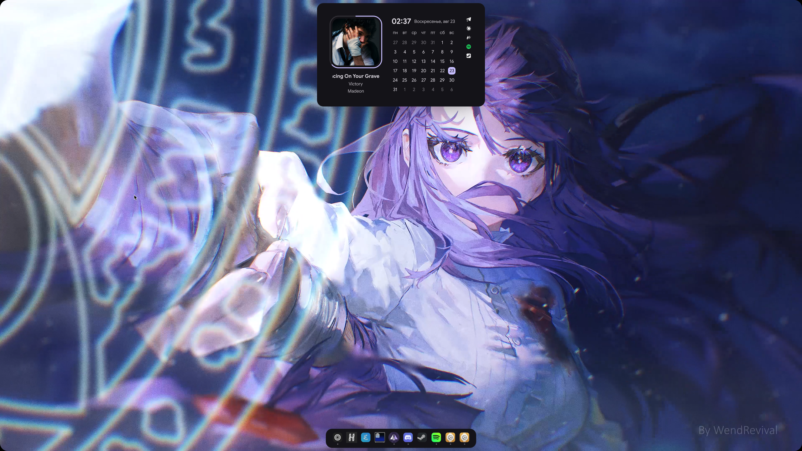
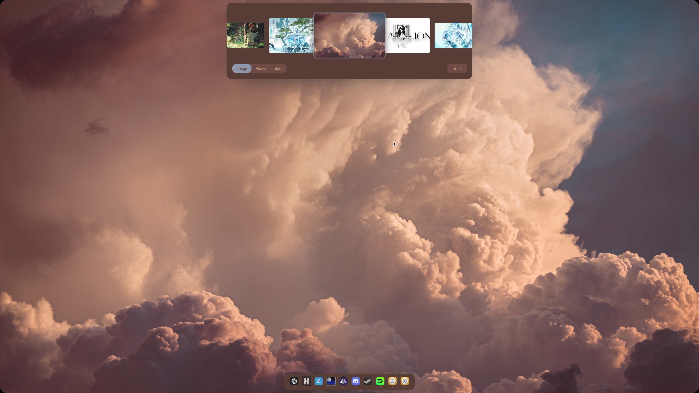
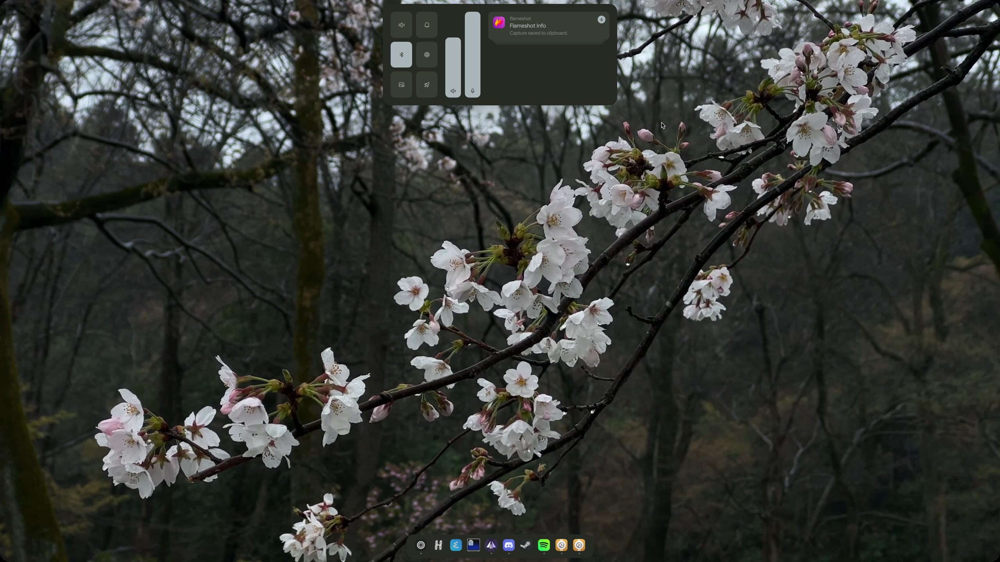

# Quickshell Configuration

<div align="center">
    
    <br />
    
    
    
</div>

## Installing

```bash
curl -fsSL https://raw.githubusercontent.com/nikkoxd/quickshell-config/main/install.sh | bash
```

This will install the Quickshell config and it's dependencies. You can then run the config with `qs -c island`. You can pass parameters after `bash -s --`.

## Features

- [x] Themes
- [x] App launcher
    - [x] Password management (using KeePassXC)
    - [x] Clipboard history
    - [x] Emoji picker
    - [x] Calculator
- [x] Audio mixer
- [x] Bluetooth controls
- [x] Notifications
- [x] Wallpaper picker
    - [x] Iris/Matugen support
    - [x] Wallpaper Engine integration
- [x] LocalSend integration
- [ ] Screenshot tool
- [x] Recording tool
- [x] Replay tool
