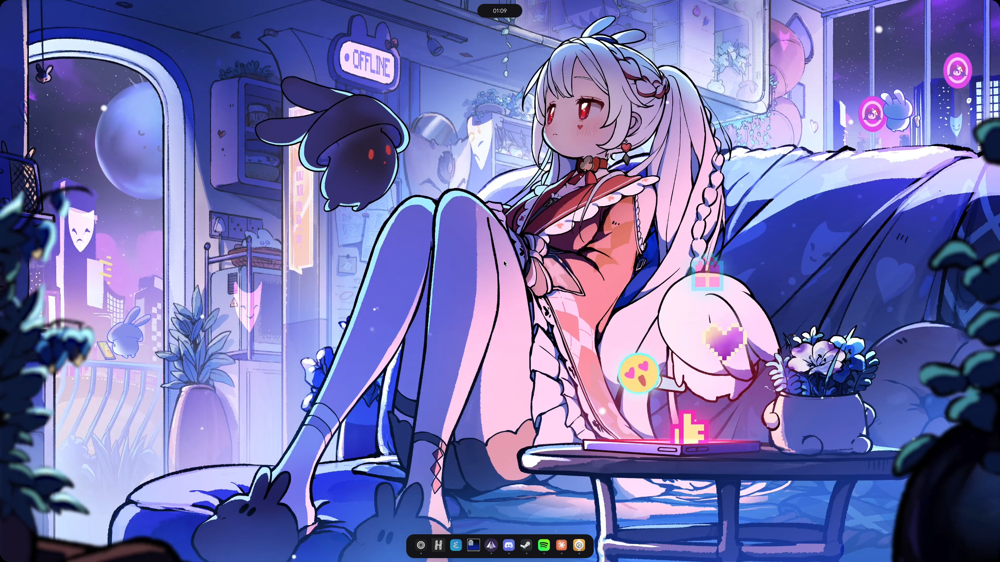

# Quickshell Configuration



## Installing

```bash
git clone https://github.com/nikkoxd/quickshell-config.git
cd quickshell-config
./install.sh
```

## Features

- [x] Themes
- [x] App launcher
    - [x] Password management (using KeePassXC)
    - [x] Clipboard history
    - [x] Emoji picker
    - [x] Calculator
- [x] Audio mixer
- [x] Bluetooth controls
- [x] Notifications
- [x] Wallpaper picker
    - [x] Iris/Matugen support
    - [x] Wallpaper Engine integration
- [x] LocalSend integration
- [ ] Screenshot tool
- [x] Recording tool
- [x] Replay tool
